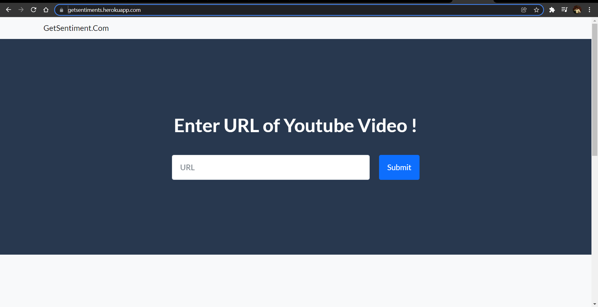
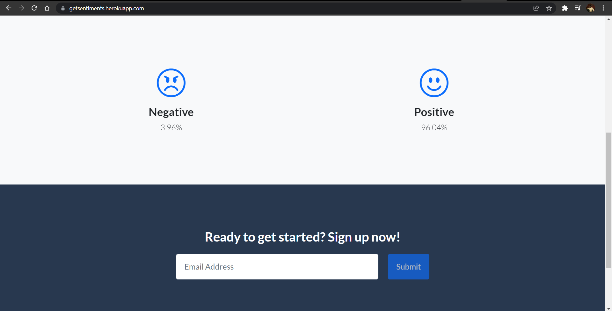
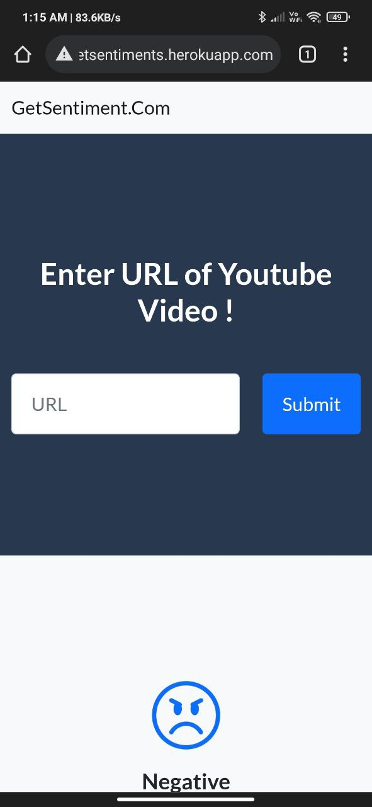
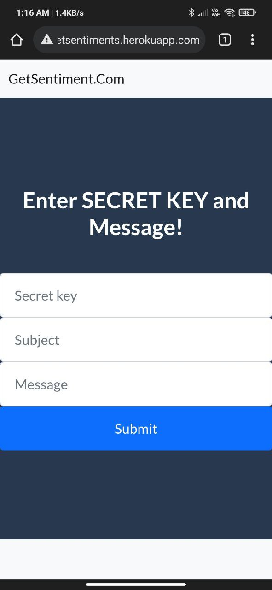

This is group project by  1. Mudit Jain(101903673)  2. Sushant Saini(101917157)  

# TITLE : GetSentiment : Sentiment Analysis

## 1.Methodology

## 2.Description
GetSentiment is a sentiment analysis web app based on machine learning algorithm which helps users to get the ability to decide whether to watch a YouTube video or not. It reads topmost comments from a video and apply the algorithm which is trained on multiple datasets like IMDB , Twitter Tweets Sentiment and various independent datasets. Concluding , it helps user get back their dislike counter through comments.

Best Model : Naive Bayes Classifier
 Best Accuracy : 91.56%

## 3.Input/Output
Input: Link of YouTube Video
 Output: Sentiment of the Video

## 4.Live Link
Link : [getsentiments.herokuapp.com](https://getsentiments.herokuapp.com/)

## 5.Screenshot of Interface

## Motivation
  As, it was my final project CS50w, I want to give my best. So, I decided to brainstrom ideas , browse ideas but didn't get any. Finally I decided to make stock market prediction app which required to have the knowledge of ML. So, I spend whole ***1 year*** going through courses , completing cs50ai , attending webinars to have the knowledge and hold of the subject. **Then, when I went back to making my web app I saw Youtube removing dislike counter finding it perfect opportunity to get back what the people actually want ,including me😅**
***

## Distinctiveness and Complexity
1. Selecting the right dataset- 
    * Selecting mere words for the dataset would lead to reduction in accuracy of model for understanding sentences. Selecting long sentences like in case of IMDB dataset also leads to decrease in accuracy as it makes model more complex and youtube comments were not that long. Twitter dataset was good for the job as it has right balance of length of sentences but turns out amount of negative and positive instances were too inequal which lead to inclination of model in particular direction as shown in visualization section of my notebook.
2. Selecting the right model-
    * Tried different models like gaussian, random forest, decision tree , logistic regression and svm, hoping to get the best model using confusion metrics and other evaluation categories. Turns out gaussian naive bayes was the man for the job.
3. Making up the web app-
    * Getting the youtube comments-
        - The first thing I tried was **youtube-comment-scraper-python 1.0.0**.It opens browser automatically and gets all the comments. It was working fine on localhost but I thought of scaling it which was obiously not possible so I dropped the idea.
        - Second thing I tried was using javascript to get youtube video comments on user side and sendind it to user as json but it also failed.
        - Third and final thing I fall upon was google api client so I used it to get the comments.
    * Loading the vocabulary dictionary and model which I have made previously ,for the preprocessing and processing respectively.
    * Setting up additional webpage for broading messages to all the users.
4. Hosting-
    * Hosting the web app on heroku by setting up the virtual environment and by doing all in migrations on server side.
    * Setting up ***smtp gmail server*** for sending clients regular updates on web app and greeting them with warm messages.
***

## What’s contained ???
1. Model Selection folder contains all the datsets and the precrossing , visualiztion , modeling , evaluating stuff in .ipynb file.
2. Sentiment the folder where there are files for url,views,template(which would be rendered), dictionary( used for preprocessing ), preprocessing and various models are there.
3. GetSentiment folder which has all the main settings(for hosting stuff and urls).
4. db.sqlite3 database which has all user's email which have signed up for our app's notification.
5. manage.py and other regular files in django and file for virtual environment and one for requirements.txt and Procfile for hosting purposes.
***

## How to run my application??
###There are 2 methods-
1. Go to [my website](http://getsentiments.herokuapp.com/) which i have hosted on heroku, put on any english video link and see the results.Navigate to [my emailing_server](https://getsentiments.herokuapp.com/emailing) to send messages to all the persons who have signed up to get updates from my app on previous page.The later step only admin can do it via an secret_key which is "KOIVEna123@"
2. On local machine-
    * Install python and pip
    * Run following commands on terminal in that particular directory-
          - pip install -r requirements.txt
          - python manage.py makemigration
          - python manage.py migrate
          - python manage.py runserver
***

## Responsiveness-
1. Computer view-
           
2. Mobile view-
          
3. Chrome Extension-
         

***
***
